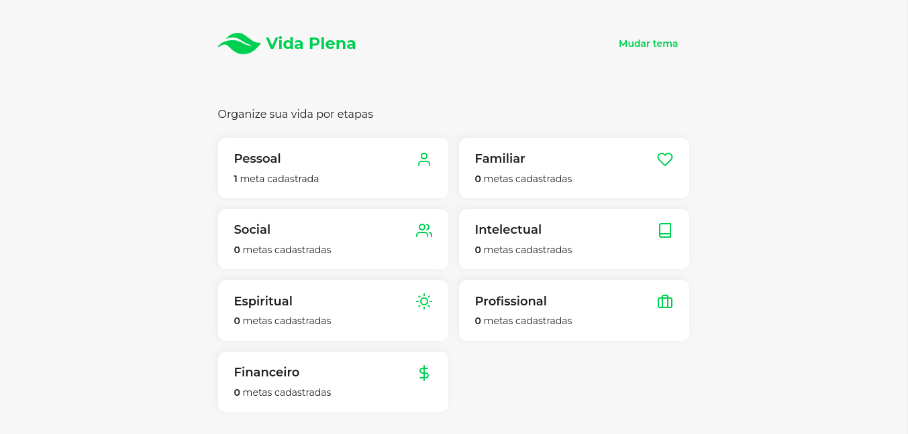

#  Vida Plena

:point_right: [**Organize sua vida por etapas**](https://app-vida-plena.vercel.app)

Sua vida pode ser dividida em **7 áreas**:
- **Pessoal:** como você lida consigo
- **Familiar:** como você lida com as pessoas com quem mais convive
- **Social:** como você lida com as outras pessoas (menor convivência)
- **Intelectual:** como você lida com conhecimentos (aprendizado e compartilhamento)
- **Espiritual:** como você lida com suas crenças, valores e virtudes
- **Profissional:** como você lida com seu trabalho
- **Financeira:** como você lida com seu dinheiro

Todos os acontecimentos da vida vão estar relacionados a pelo menos uma dessas áreas e, geralmente, estão relacionados a mais que uma.

### :bulb: Exemplo Prático

Imagine um trabalhador comum que vai para empresa vários dias ao longo da semana.

Se é um trabalhador, logo percebemos a presenta da área **PROFISSIONAL**.

Também podemos concluir, apenas com essa informação, que esse trabalhador recebe uma remuneração pelo seu trabalho: área **FINANCEIRA**.

Veja que poderíamos continuar a lógica e perceber uma conexão com outras áreas, como a **SOCIAL** (colegas de trabalho, por exemplo) e **PESSOAL** (metas do trabalhador).

Ou seja, organizando sua vida por etapas você conseguirá alcançar as metas que mais deseja em todas as áreas da vida!

:point_right: [**Organize sua vida por etapas**](https://app-vida-plena.vercel.app)

## :computer: Tecnologias Utilizadas

- ReactJS
- ViteJS
- React Router DOM
- TypeScript
- ESLint

